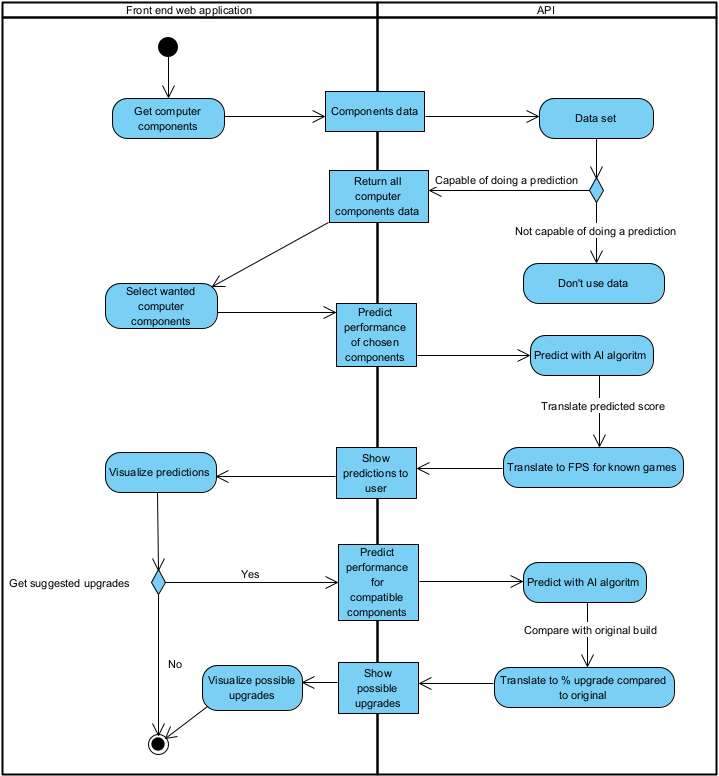
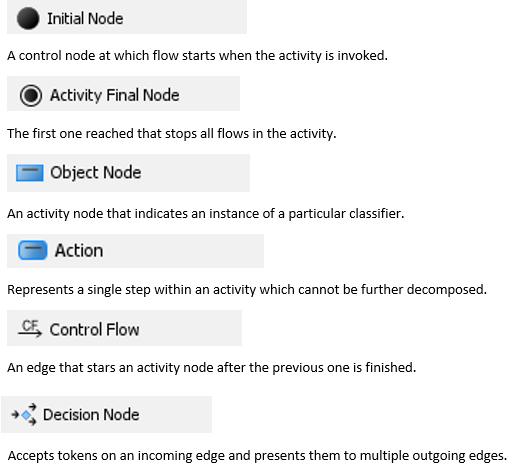
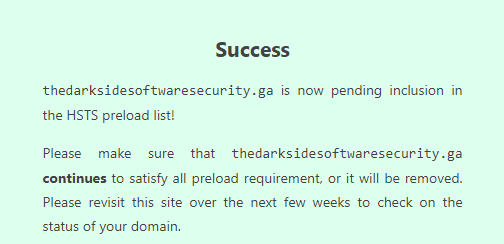

# Goal
De game industrie is een snel groeiende industrie dat volgens experts kan uitgroeien naar een industrie met een marktwaarde van $ 300 miljard. Met miljarden dollars winst en meer dan 2,5
miljard gamers wereldwijd is dit een interessante doelgroep om een rendabele applicatie voor te ontwikkelen. Deze groeiende game industrie gaat gepaard met de hardware die noodzakelijk is om de industrie te betreden. Beginnende en amateur gamers komen dikwijls voor een moeilijke keuze te staan wanneer ze moeten beslissen welke hardware ze nodig hebben om aan hun game noden te voldoen. We zouden een applicatie willen creëren die een amateur gamer kan helpen zijn computer onderdelen uit te kunnen kiezen en bij te leren/informen over computer hardware. De applicatie zou dan kunnen gebruikt worden om klanten te overtuigen tot aankoop en kan verkopers helpen om klanten correct te informeren. Deze applicatie zal aan de hand van een dataset van computer hardware voorspellingen maken van de performantie van een computer. Hier bij kan een gebruiker al zijn componenten ingeven die hij al heeft en dan 1 component vervangen om een upgrade voor zijn PC te simuleren. Hij kan ook 2 computers vergelijken om zo zijn keuze tot aankoop makkelijker te maken. 

De data voor deze applicatie is afkomstig van https://benchmark.unigine.com/. We hebben toelating om alle publieke data die ter beschikking staat te gebruiken voor onze applicatie.

# Acceptance criteria
De applicatie zou meerdere functies moeten kunnen uitvoeren:
- er is een lijst van alle componenten aanwezig waarvan we genoeg data hebben om correcte voorspelling uit te voeren
- we filteren componenten zodat enkel componenten die met elkaar compatibel zijn kunnen geselecteerd worden
- de gebruiker kan componenten selecteren en een voorspelling aanvragen
- de gebruiker zal een visualisatie te zien krijgen van de voorspelling door middel van verwachte gemiddelde FPS te tonen bij een aantal bekende spellen
- de gebruiker kan zelf mogelijke upgrades aanvragen waardoor er meerdere voorspellingen zullen uitgevoerd worden met alleen compatibele componenten
- er is een tutorial aanwezig die uitlegt hoe je de applicatie kan gebruiken

# Threat model

## Dataflow

Legende van de flow chart

## threats

| kwetsbaarheden  | omschrijving | oplossing |
| ------------- | ------------- |------------- 
| Data Integriteit  | Data integriteit staat in het teken van het behouden en beschermen van de juistheid en de consistentie van data  | Hashing, we nemen de data en gaan deze met behulp van een key omzetten naar een andere beperktere vorm. Dit gaat er voor zorgen dat de data niet te herkennen is voor personen/programmas zonder de juiste key. Hierdoor bewaren wij de integriteit van onze data. |
| Overbelasting API  | Het overbelaste van de API door te veel requests  | API tokens, we gaan een token generenen op de api en deze in onze applicatie verwerken, zo is het onmogelijk om aan de API te kunnen vonder de applicatie.  |
| (D)DOS: DDoS-mitigatie | Met een (Distributed) Denial-of-Service-aanval (DDoS-aanval) wordt de capaciteit van onlinediensten of de ondersteunende servers en netwerkapparatuur aangevallen. Het resultaat van deze aanval is dat diensten slecht of helemaal niet meer bereikbaar zijn voor medewerkers of klanten.  | DDoS-mitigatie, er zit een standaard DDoS-mitigatie in Heroku (waar onze applicatie gehost is). Wij zijn aan het kijken voor gebruik te maken van Rack::Attack Express Slow Down of Express Rate Limit om in onze applicatie ook extra beveiliging te steken.  |
| Injecties  | kwaadaardige code wordt ingevoegd in een kwetsbaar softwareprogramma om zo toegang tot het programma te krijgen  | API is niet toegankelijk voor gebruiker-input |
| man-in-the-middle attacks  | Een man-in-the-middle-attack (MITM) is een algemene term voor wanneer een dader zich positioneert in een gesprek tussen een gebruiker en een applicatie  | HTTPS |
| input validatie | Foute input van de gebruiker proberen te vermijden | Met het laravel framework en input checks beschermen we de applicatie van cross-site scripting, Cross-site request forgery, sql injections, etc...   |

# HSTS
HTTP Strict Transport Security

De site staat nu in de HSTS Google Chrome preload list. 

# Deployment
Hosting van de externe API, database en webapplicatie gaat via https://www.heroku.com/
https://thedarksidesoftwaresecurity.ga/

# Planning
https://trello.com/b/TfkvJOT3
